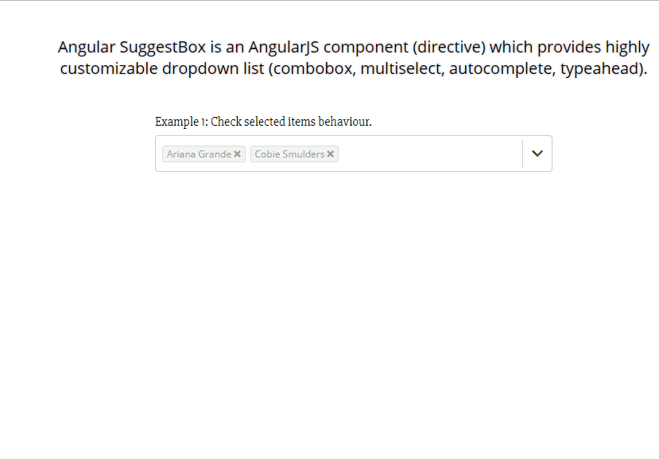

This Project was forked from: <https://github.com/Ascarbek/suggestbox> <br/> 
Unfortunately Bower didnt register my forked project even though I created its own release, so I had to upload it this way. 

# Angular SuggestBox

Angular SuggestBox is an AngularJS component (directive) which provides highly customizable dropdown list (combobox, multiselect, autocomplete).

# Features

-   Fully customizable layout. Directive comes without template. It uses the html layout that you provide inside the element.
-   Multiple items selection. Customizable by _sb-max-selection_ option
-   Duplicate item selection option.
-   Allow adding

# Added Features in this Fork

-   Items in the input field are now clickable
-   When choosing items from Dropdown with the mouse, whatever has been typed will be cleared (**dropdown will stay open**)
-   When choosing items from Dropdown with enter, whatever has been typed will be cleared, (**dropdown will be closed**)

# Install

```bash
bower install angularjs-suggestbox-ldv
```

# Examples

Live Demo available at (**without added Features**)
<http://ascarbek.github.io/suggestbox/>

Gif of added Features below.

# Documentation

## Attributes

-   sb-list-item-alias | string optional 'i' |
-   sb-list | Array Required |
-   sb-model-alias | string optional 's' |
-   sb-model | array optional |
-   sb-selected-indexes | array optional |
-   sb-max-selection | integer optional 0 |
-   sb-allow-duplicates | boolean optional false |
-   sb-allow-free-text | boolean optional false |
-   sb-allow-add-item | boolean optional false |
-   sb-new-item-field | string optional 'name' |
-   sb-search-fields | string optional null |
-   sb-key-fields | string optional null |
-   sb-select-first-list-item | boolean optional false |
-   sb-broadcast-event-name | string optional 'azSuggestBoxSelect' |
-   sb-selected-list-item-class | string optional 'ng-hide' |
-   sb-highlighted-list-item-class | string optional 'sb-list-item-highlight |
-   sb-close-list-on-select | boolean optional false |
-   sb-on-selection-change | function optional |

## Added Attributes in this Fork

-   sb-callback-click-on-item | function | optional
-   sb-selection-item-data | data you want to be passed for the click | optional
-   If you want to pass the sb-selection-item-data to the function as well, then passed argument name in HTML must be **selectionItemData**, e.g:

```HTML
<div az-suggest-box 
     sb-list="vm.names" 
     sb-callback-click-on-item="vm.clickTest(selectionItemData)" 
     sb-model="vm.model1" 
     sb-key-fields="name" 
     sb-search-fields="name" 
     class="suggest-box">
    <div class="select">
        <div class="input">
            <div sb-selection-item class="selection-item">
                <sb-click-item 
                               class="sbClickItem" 
                               sb-selection-item-data="{{s.name}}"> {{s.name}} </sb-click-item>&nbsp;
                <span sb-remove-item-from-selection class="rem-btn"><i class="fa fa-times"></i></span>
            </div>
            <input sb-trigger-area sb-type-ahead tabindex="1">
        </div>

        <button sb-trigger-area><i class="fa fa-chevron-down"></i></button>
    </div>
```

See below for Example.

## Directives

-   az-suggest-box| root
-   sb-selection-item| selected items repeater
-   sb-remove-item-from-selection| button to remove item from selection must be placed inside sb-selection-item
-   sb-trigger-area|
-   sb-type-ahead| handles search throw list items. must be placed on input element
-   sb-dropdown-item | dropdown item repeater

## Added Directive in this Fork

-   sb-click-item | click on item handler | **_Must be Element_**

# Example

Check out the Demo in this Repo for clearer understanding of added Features.
Watch this gif for quick demonstration of added Features.


